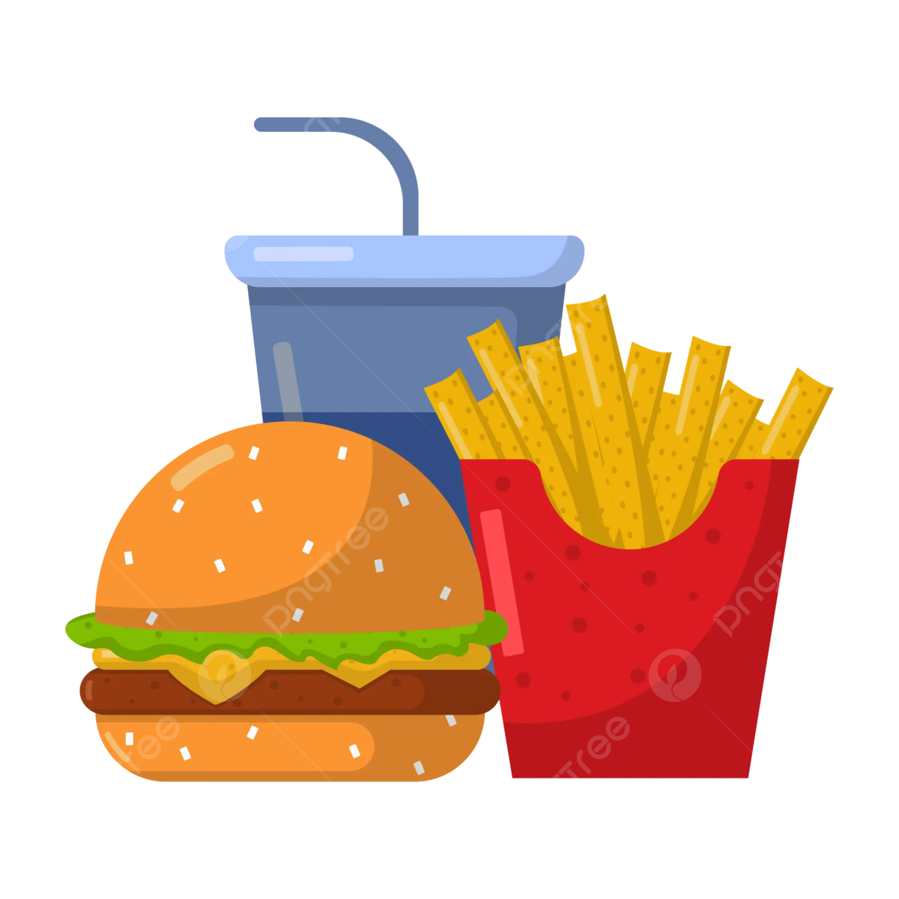
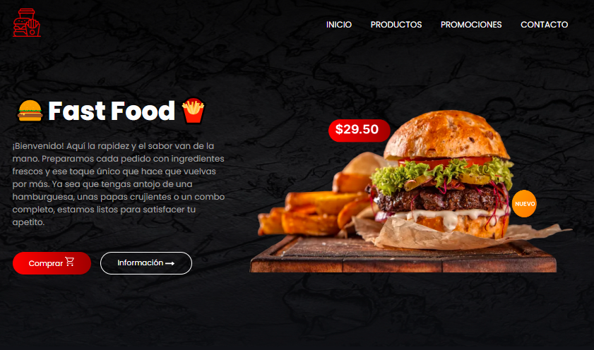
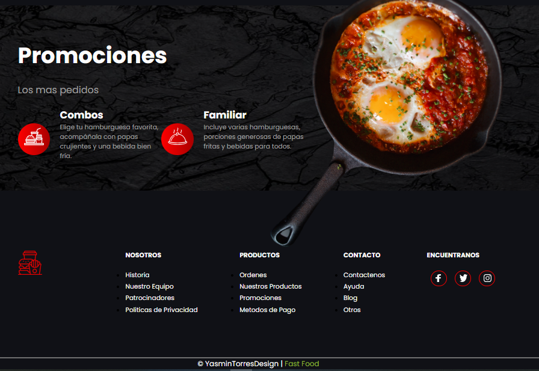

# Fast Food   | Página Web de Comida Rápida


**Fast Food** es una página web diseñada para mostrar el menú, las promociones y la información de contacto de un restaurante de comida rápida. 
Este proyecto busca ofrecer una experiencia visual atractiva y moderna, destacando productos como hamburguesas, tacos, papas fritas y combos familiares.

---

## 📂 Estructura del Proyecto
```
FAST-FOOD/
│
├── images/ # Imágenes utilizadas en la página (productos, íconos, fondos, etc.)
├── index.html # Página principal del sitio web
├── script.js # Archivo para interacción y lógica JS
└── style.css # Estilos personalizados para la página
```


---

## 🖥️ Secciones

### 🏠 Vista de Inicio
- Menú de navegación (Inicio, Productos, Promociones, Contacto).
- Bienvenida al usuario.
- Imagen destacada de hamburguesa.
- Botones de llamada a la acción.



---

### 📋 Menú
- Categorías: Hamburguesas, Tacos y Papas Fritas.
- Tarjetas de producto con descripción, precio y botón de compra.
- Opción de "Cargar Más".


---

### 💥 Promociones
- Sección con los productos más pedidos: Combos y Familiar.
- Diseño llamativo con íconos y descripciones.




### 📞 Footer
- Secciones rápidas: Nosotros, Productos, Contacto y Redes Sociales.
- Créditos de diseño.

---

## 🛠️ Tecnologías Utilizadas

- **HTML5**: Estructura del sitio.
- **CSS3**: Estilos y diseño visual.
- **JavaScript**: Archivo preparado para futuras funciones dinámicas.
- **Imágenes**: Personalizadas para ambientar el sitio.

---

## ✅ Características del Proyecto

- Diseño responsivo (ajustable a diferentes dispositivos).
- Menú interactivo por categorías.
- Sección de promociones destacadas.
- Footer con enlaces rápidos y redes sociales.

---

## 🌐 Despliegue

Este proyecto ha sido desplegado con **GitHub Pages**, una herramienta gratuita para alojar sitios web estáticos directamente desde un repositorio de GitHub.

🔗 Puedes ver el sitio en línea aquí:  
https://yasmintorresdesign.github.io/Fast-Food/

---

## ✍️ Autora

**Yasmin Torres**  
*Diseñadora de productos industriales y desarrolladora web.*  
Para más información o colaboraciones, puedes escribirme a:
📧 yatorres.73@gmail.com

---

## 📌 Nota

Este proyecto es de carácter educativo y forma parte de una serie de trabajos para fortalecer habilidades en diseño web y desarrollo frontend.

---

